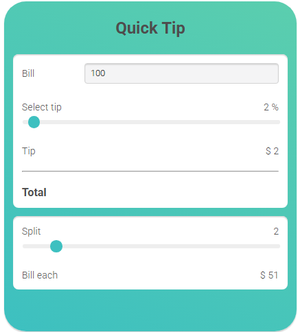

# 💸 Quick Tip Calculator

**Quick Tip Calculator** is a clean, responsive, and easy-to-use app for calculating tips and splitting bills.  
Perfect for use at restaurants, bars, or any time you need to quickly and fairly share a bill!

---

## ✨ Features

- 💵 **Bill input:** Enter the total bill amount.
- 🧮 **Tip percentage slider:** Adjust the tip percentage with a smooth slider.
- 💰 **Instant tip calculation:** Automatically shows the tip amount based on your selected percentage.
- 👥 **Bill splitting:** Choose how many people to split the bill with and see how much each one pays.
- 🎨 **Modern UI:** Stylish gradient background with responsive layout.

---

## 🛠️ Built With

- **HTML5**
- **CSS3** (with gradients and modern styling)
- **JavaScript** (for calculation logic and interactivity)

---

## 📷 Preview

> 

---

## 🚀 How to Use

1. Enter the total bill amount.
2. Select your desired tip percentage using the slider.
3. Choose how many people will split the bill.
4. Instantly view the tip amount and the amount each person should pay.

---

Feel free to contribute or customize this project to your needs!
